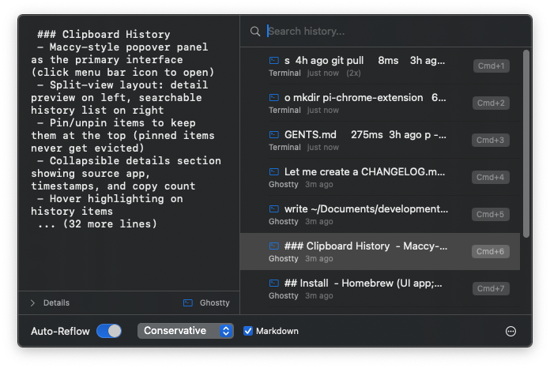

# Reflow

macOS 15+ menu bar utility that unwraps hard-wrapped terminal text. Detects clipboard copies from terminal apps and provides smart paste options with line wrapping removed, while preserving paragraph breaks, code blocks, and lists.



## Install

- Download from GitHub Releases: (coming soon)
- Or build from source (see Build section below)

## How it works

When you copy text from a terminal, it often contains hard line breaks at 80 or 120 characters. Reflow detects these terminal copies and lets you paste with the wrapping removed.

**Recognized terminals:** Terminal.app, iTerm2, Ghostty, Warp, Kitty, Alacritty, Hyper, WezTerm

**Mixed-source detection:** VS Code, Cursor, Zed (detects terminal output from integrated terminals)

## Features

- **Clipboard history** with split-view popover (detail preview + searchable list)
- **Pin items** to keep them at the top of history
- **Search** history in real-time
- **Markdown-aware** mode preserves headers, code fences, blockquotes, and tables
- **Custom patterns** via regex to preserve specific lines
- **Statistics** tracking (session + all-time)
- **Global hotkeys** for all actions
- **CLI tool** (`reflow-cli`) for scripting

## Aggressiveness Levels

Controls how aggressively Reflow joins wrapped lines:

| Level | Behavior | Best for |
|-------|----------|----------|
| **Conservative** | Preserves lines ending with `.` `!` `?` `:` or other punctuation. Only joins lines that appear mid-sentence. | Mixed content with prose and code |
| **Normal** | Joins most lines, but preserves obvious paragraph boundaries and special patterns. | General terminal output (default) |
| **Aggressive** | Joins everything except blank lines and markdown structures. | Heavily wrapped text that needs maximum cleanup |

## Keyboard Shortcuts

Default shortcuts (configurable in Settings):

| Action | Shortcut |
|--------|----------|
| Paste Reflowed | Cmd+Ctrl+V |
| Paste Original | Cmd+Ctrl+Shift+V |
| Toggle Auto-Reflow | Cmd+Ctrl+R |
| Show History Panel | Cmd+Ctrl+H |
| Quick Paste 1-9 | Cmd+1 through Cmd+9 |

## CLI

```bash
# Basic usage (stdin)
pbpaste | reflow-cli

# From file
reflow-cli --file input.txt

# With options
reflow-cli -a conservative --stats
reflow-cli --no-markdown
reflow-cli --pattern "^TODO:" --pattern "^FIXME:"

# Analysis tools
reflow-cli --analyze-width
reflow-cli --check-terminal
```

## Build

```bash
swift build -c release
swift test
```

## Requirements

- macOS 15.0+
- Accessibility permission (for paste injection)

## Changelog

See [CHANGELOG.md](CHANGELOG.md).

## License

MIT
